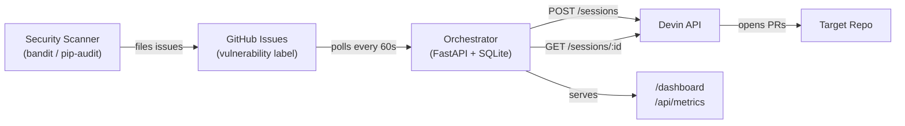

# Vulnerability Remediation Orchestrator

> Event-driven autonomous remediation of security vulnerabilities using the Devin API.
> Scanners surface findings, the orchestrator dispatches Devin sessions, Devin opens PRs.

## The Problem

Security teams find vulnerabilities faster than engineering teams can fix them. Detection is solved — Snyk, pip-audit, bandit, Dependabot all surface findings reliably. The bottleneck is **remediation**: tickets sit in backlogs, get reassigned, slip releases. This system closes the loop by dispatching [Devin](https://devin.ai) to remediate each finding autonomously.

## What It Does

- Polls a GitHub repo every 60 seconds for issues with the `vulnerability` label
- Dispatches a Devin session per issue using a generic prompt template
- Tracks status (`pending` / `running` / `completed` / `failed` / `needs_review`) in SQLite
- Surfaces live state via `/dashboard` (HTML) and `/api/metrics` (JSON)
- Designed to be triggered by any source: human-filed tickets, scheduled scanner runs, webhooks, or external systems

## Architecture



The orchestrator is intentionally **stateless between restarts** aside from its SQLite database. It discovers work by polling (not webhooks) so it can run behind a firewall without inbound connectivity. Each Devin session gets a self-contained prompt with the issue context — no shared state between sessions.

## Dashboard


The dashboard at `/dashboard` provides real-time KPIs and a task table. Each row links back to the GitHub issue, the Devin session, and the resulting PR. Buttons trigger manual poll / dispatch / sync cycles for debugging.

## Quick Start

```bash
cp .env.example .env          # add your tokens
docker compose up --build      # builds + starts on :8000
curl http://localhost:8000/health
```

| Variable | Purpose |
|---|---|
| `GITHUB_TOKEN` | PAT with `repo` scope for the target repository |
| `GITHUB_REPO` | Target repo in `owner/repo` format |
| `DEVIN_API_KEY` | Devin Enterprise API key |
| `POLL_INTERVAL_SECONDS` | Polling frequency (default `60`) |

## API

| Method | Path | Description |
|--------|------|-------------|
| GET | `/health` | Service + database health check |
| POST | `/poll` | Manually trigger GitHub polling; returns new/total counts |
| GET | `/tasks` | All tasks as JSON |
| POST | `/dispatch` | Dispatch all `pending` tasks to Devin |
| POST | `/sync-statuses` | Poll Devin API for `running` task statuses and update DB |
| GET | `/dashboard` | HTML dashboard with KPIs and task table |
| GET | `/api/metrics` | JSON metrics (counts by status, completion/failure rates) |

## End-to-End Demo

```bash
# 1. Start the orchestrator
docker compose up --build

# 2. Poll GitHub for vulnerability issues
curl -X POST http://localhost:8000/poll

# 3. Dispatch pending tasks to Devin
curl -X POST http://localhost:8000/dispatch

# 4. Wait a few minutes, then sync statuses
curl -X POST http://localhost:8000/sync-statuses

# 5. View results
curl http://localhost:8000/tasks | jq
open http://localhost:8000/dashboard
```

Or just let it run — the background loop polls, dispatches, and syncs automatically every 60 seconds.

## Design Decisions

| Decision | Rationale |
|---|---|
| **Polling over webhooks** | Simpler deployment; works behind firewalls without ngrok or public endpoints. Polling interval is configurable. |
| **SQLite over Postgres** | Single-file database with zero ops overhead. Sufficient for the task volume of a single-repo orchestrator. Swappable later via the `DB_PATH` env var. |
| **One Devin session per issue** | Each session gets a self-contained prompt with full issue context. No shared state means sessions can't interfere with each other, and failures are isolated. |
| **Generic prompt template** | The same prompt structure works for any vulnerability type — bandit rules, CVEs, unsafe imports. Devin reads the issue body for specifics. |
| **Status as a finite state machine** | `pending → running → completed / failed / needs_review`. Clear transitions make the dashboard and metrics reliable. |
| **No authentication on dashboard** | Designed for internal / localhost use. Add a reverse proxy (Caddy, nginx) with auth for production exposure. |

## Project Structure

```
├── main.py               # Orchestrator: FastAPI app, polling loop, Devin API client, dashboard
├── requirements.txt      # Python dependencies (FastAPI, PyGithub, requests, uvicorn)
├── Dockerfile            # Python 3.11-slim container
├── docker-compose.yml    # Single-service compose with .env and volume mount
├── .env.example          # Template for required environment variables
└── docs/
    └── dashboard.png     # Dashboard screenshot
```

## Stack

- **Python 3.11** / **FastAPI** — async web framework with automatic OpenAPI docs
- **PyGithub** — GitHub API client for issue polling
- **SQLite** — embedded task store
- **Docker Compose** — single-command deployment
- **Pico CSS** — classless CSS framework for the dashboard UI

## Limitations & Next Steps

- **Detection trigger is currently external.** A scheduled `pip-audit`/`bandit` runner that auto-files issues from raw scanner output would close the upstream loop end-to-end.
- **No retry policy.** Failed Devin sessions stay failed. Backoff + retry would help with transient API errors.
- **No PR auto-review.** A second Devin session reviewing the first one's PR would catch quality issues before human review.
- **Single-repo orchestrator.** Currently watches one `GITHUB_REPO`. A multi-tenant version would support fleets of repos.
