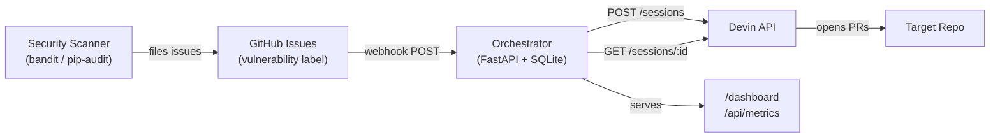
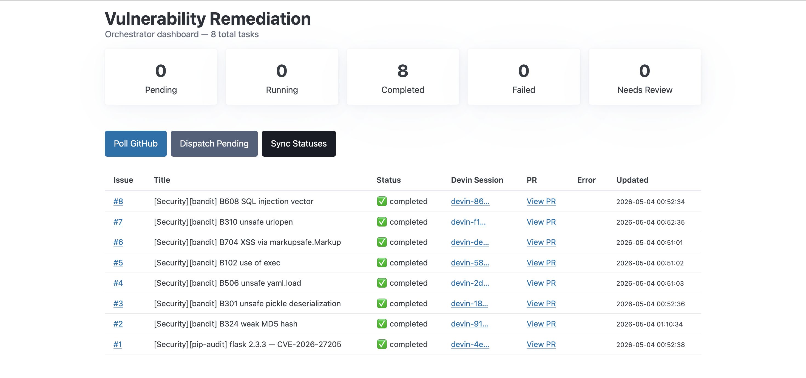

# Vulnerability Remediation Orchestrator

> Event-driven autonomous remediation of security vulnerabilities using the Devin API.
> Scanners surface findings, the orchestrator dispatches Devin sessions, Devin opens PRs.

## The Problem

Security teams find vulnerabilities faster than engineering teams can fix them. Detection is solved — Snyk, pip-audit, bandit, Dependabot all surface findings reliably. The bottleneck is **remediation**: tickets sit in backlogs, get reassigned, slip releases. This system closes the loop by dispatching [Devin](https://devin.ai) to remediate each finding autonomously.

## What It Does

- Receives GitHub webhook events when issues with the `vulnerability` label are created, and immediately dispatches remediation
- Dispatches a Devin session per issue using a generic prompt template
- Tracks status (`pending` / `running` / `completed` / `failed` / `needs_review`) in SQLite
- Surfaces live state via `/dashboard` (HTML) and `/api/metrics` (JSON)
- Designed to be triggered by any source: human-filed tickets, scheduled scanner runs, webhooks, or external systems

## Architecture



The orchestrator receives GitHub webhook events for real-time issue ingestion. A background loop continues to poll Devin session statuses. The `/poll` endpoint remains available as a manual fallback. Each Devin session gets a self-contained prompt with the issue context — no shared state between sessions.

## Dashboard



The dashboard at `/dashboard` provides real-time KPIs and a task table. Each row links back to the GitHub issue, the Devin session, and the resulting PR. Buttons trigger manual poll / dispatch / sync cycles for debugging.

## Quick Start

```bash
cp .env.example .env          # add your tokens
docker compose up --build      # builds + starts on :8000
curl http://localhost:8000/health
```

| Variable | Purpose |
|---|---|
| `GITHUB_TOKEN` | PAT with `repo` scope for the target repository |
| `GITHUB_REPO` | Target repo in `owner/repo` format |
| `DEVIN_API_KEY` | Devin Enterprise API key |
| `POLL_INTERVAL_SECONDS` | Polling frequency (default `60`) |
| `GITHUB_WEBHOOK_SECRET` | Shared secret for webhook HMAC-SHA256 verification |

## API

| Method | Path | Description |
|--------|------|-------------|
| GET | `/health` | Service + database health check |
| POST | `/poll` | Manually trigger GitHub polling; returns new/total counts |
| GET | `/tasks` | All tasks as JSON |
| POST | `/dispatch` | Dispatch all `pending` tasks to Devin |
| POST | `/sync-statuses` | Poll Devin API for `running` task statuses and update DB |
| GET | `/dashboard` | HTML dashboard with KPIs and task table |
| GET | `/api/metrics` | JSON metrics (counts by status, completion/failure rates) |
| POST | `/webhook/github` | GitHub webhook receiver — ingests issues with `vulnerability` label |

## Webhook Setup

1. Go to your target repo's **Settings > Webhooks > Add webhook**
2. Set **Payload URL** to `https://your-host/webhook/github`
3. Set **Content type** to `application/json`
4. Set **Secret** to match `GITHUB_WEBHOOK_SECRET` in your `.env`
5. Under "Which events would you like to trigger this webhook?", select **Let me select individual events** and check only **Issues**
6. Click **Add webhook**

The orchestrator will now receive events instantly when issues are opened or labeled with `vulnerability`. The `/poll` endpoint is still available as a manual fallback.

## End-to-End Demo

```bash
# 1. Start the orchestrator
docker compose up --build

# 2. Configure the GitHub webhook (see Webhook Setup above)

# 3. Create a GitHub issue with the "vulnerability" label
#    The webhook fires, the orchestrator syncs and dispatches automatically

# 4. Check status
curl http://localhost:8000/tasks | jq
open http://localhost:8000/dashboard

# 5. Manual fallback: poll GitHub directly if needed
curl -X POST http://localhost:8000/poll
curl -X POST http://localhost:8000/dispatch
```

The background loop syncs Devin session statuses every 60 seconds automatically.

## Project Structure

```
├── main.py               # Orchestrator: FastAPI app, polling loop, Devin API client, dashboard
├── requirements.txt      # Python dependencies (FastAPI, PyGithub, requests, uvicorn)
├── Dockerfile            # Python 3.11-slim container
├── docker-compose.yml    # Single-service compose with .env and volume mount
├── .env.example          # Template for required environment variables
└── docs/
    └── dashboard.png     # Dashboard screenshot
```

## Stack

- **Python 3.11** / **FastAPI** — async web framework with automatic OpenAPI docs
- **PyGithub** — GitHub API client for issue polling
- **SQLite** — embedded task store
- **Docker Compose** — single-command deployment
- **Pico CSS** — classless CSS framework for the dashboard UI

